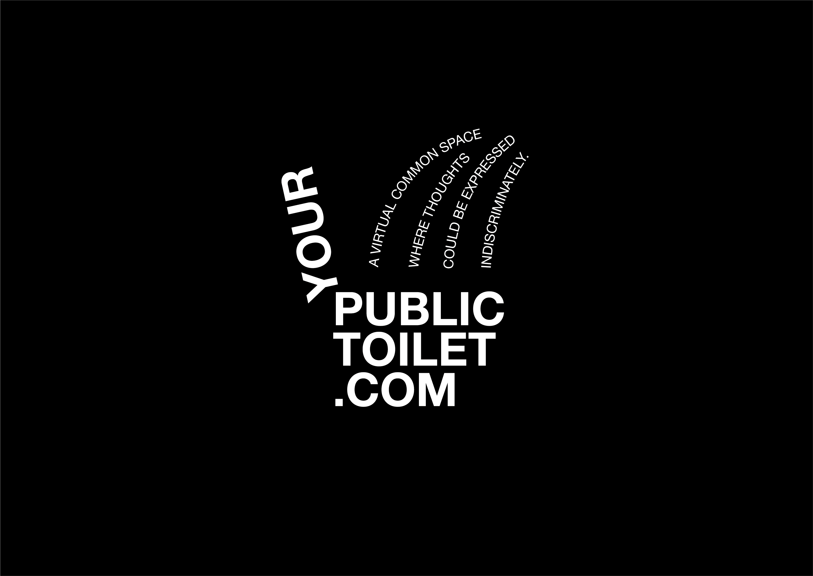
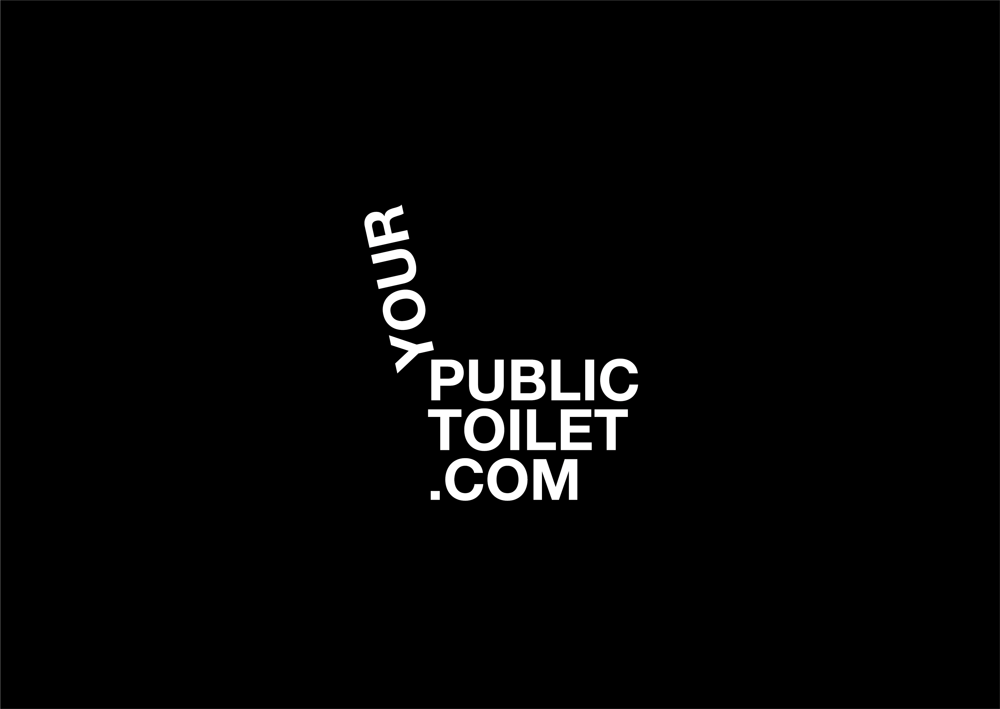
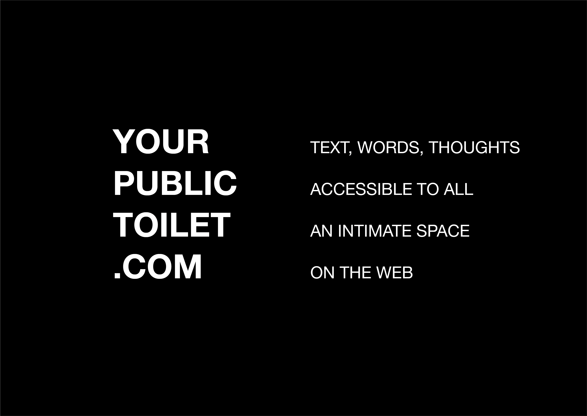

# YOURPUBLICTOILET.COM

YOURPUBLICTOILET.COM is a university project developed and realized with p5.js library in Creative Coding class, taught by Mauri Michele and Andrea Benedetti at Politecnico di Milano.
The main purpose of our project is to create a virtual common space where thoughts could be expressed indiscriminately.

## INDEX

#### 1. [AESTHETIC RESEARCH](aesthetic-and-concept-resarch) 	                                                              
  1.	How we conceived the idea
  2.	Why the toilet?

#### 2. CONCEPT
  1. How does it work?
  2. What we expect

#### 3. DEVELOPMENT
  1. Interface
  2. Lobby
  3. Toilet system
  4. Tile search
  5. Geolocaction
  6. Tools

#### 4. ISSUES AND IMPROVEMENTS
  1. JSON/placement
  2. HTML

#### 5.BERLIN NOISE 13

## 1. AESTHETIC AND CONCEPT RESEARCH

### 1.1 How we conceived the idea

We wanted to shape the realm of ideas, of pure concepts freed of their earthly burden.
Clear words that float in an immense, navigable, dark space.
But apparently flying high served to fall back to the ground; to come up with something that makes sense here, between us, in our daily lives.
We started thinking about a project called “the Hyperuranium” to get where people express themselves - literally - in the most intimate, direct, primordial way.
We went down to the public toilet.

### 2.2 Why the toilet?

Each toilet is a world of its own, reflecting the most direct thoughts of those who are using it.
In addition to the obvious vulgarities, public toilets are signed. There are stickers for bands and collectives. Happenings and hidden events are communicated. We exchange impressions, insults, cues.
We continue each other drawings.
It is a space full of instant words, of raw, animalistic, spontaneous, dreamy, festive, quarrelsome, chaotic, loving ideas. 
A collective space but full of individual expression.

## 2. CONCEPT

### 2.1 How does it work?

* Each toilet represent a geographical area (a city, an event...)
* You can access every toilet from everywhere.
* You can write only on the toilet on you current location.
* Walls are not completely zoomable out, forcing you to explore.
* Write your text into the editor, move it around the toilet and place it.
* One font, but customizable in color, rotation, size, letters and line spacing.

### 2.2 What we expect

* Events communication
* Collective poetry
* Collective typographic drawing
* Public chat
* Search for inspiration
* Self expression
* Ads
* Contact making
* Other unexpected internet phenomena

## 3. DEVELOPMENT

### 3.1 Interface

The interface is linear and minimal, essential, white and black. From the homepage the user can access the lobby, the waiting room before the toilets. In the lobby the user can select the toilet in his area and if not yet present he can request one thanks to a button. The geolocation coordinates are visible on this page and there is an audio player that emulates the noises of the disco bathroom environment. Once the door is selected, you enter the toilet, if the user is in the toilet area, the editor mode opens with which he can edit his messages. Typographic functions are: line spacing, letter spacing, size, and rotation.

### 3.2 Lobby

### 3.2 Toilet system

### 3.3 Tile search

### 3.4 Geolocation

### 3.5 Tools

## 4. ISSUES & IMPROVEMENTS

### 4.1 JSON/placement
The system is based on a JSON database which is rewritten at each PLACEMENT, making the page heavy and affecting the fluidity of the navigation.

-> Use database service services such as FIREBASE which guarantee a smooth upload without continuous file rewriting

### 4.2 HTML
A very large page is created with many 
 and this increases the weight of the page.

-> Do not use an HTML page but create a custom model with a behavior similar to Google Maps
